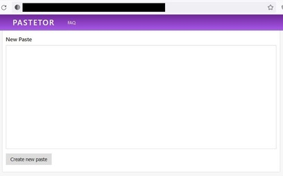
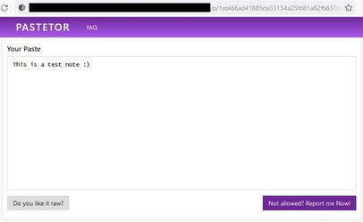
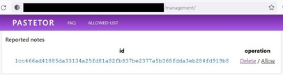
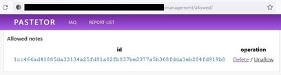

# PasteTor

A simple Paste Tor service with a small management overlay written in golang + a redis database for high performance
needs.
Allows quick setup for your own hidden service.

### Features

Add a note and send it to whoever should watch this note. Totally secure over Tor!



View your or shared stored note under a static link, can be viewed as raw note without ui. 
If there is content which should not be allowed there is a report option which makes it possible to manage content for the admin.



Manage the reported notes and whitelisted notes as admin in the `/management/` section.



Whitelisted reported can not be reported again until they are removed from this list.



### Requirements

Docker + Docker-Compose

Around 200mb space for the docker images. After building the huge buster image can be removed.

### Setup

```bash
sudo bash rebuild.sh
```

Edit your `user.list` and replace teh default passwords and users with your own username/password.
Ensure that its secure enough (length + charset).

## Start

```bash
docker-compose up -d
# Wait 10 seconds and get your hostname:
sudo cat data/tor/hidden_service/hostname
```